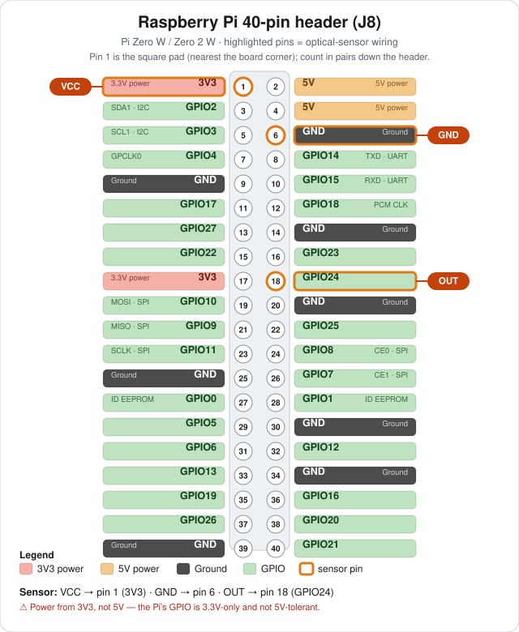

# Film Scanning Rig

> ## ⚠️ Alpha
> It has completed a real production run end-to-end on the author's setup
> (Canon EOS 400D on a Raspberry Pi appliance), but it's been tested on exactly
> one camera and rig, has **no authentication** (designed for a trusted home
> LAN), and interfaces may change. Use at your own risk; expect rough edges.

Digitize 35mm slides and negatives with a tethered Canon DSLR — a web app you
drive from any browser to place a slide, capture it, and review the batch.

> **Status:** proven in production — the author's 35mm slide collection has been
> fully digitized with this rig (hands-free sensor-triggered batches on the Pi
> appliance, hundreds of slides per session). The negatives workflow (RAW preset,
> inversion-ready files) is built but hasn't had a production run yet, and the
> automated XY gantry is deferred. See [CLAUDE.md](CLAUDE.md) for hardware/dev
> notes.

## What it is

A DSLR is mounted over a backlit high-CRI light pad; film is placed in a holder
under the lens and triggered over USB. The host runs a small **stdlib-only
Python web app** (`capture_server.py`) that talks to the camera via `gphoto2`
and serves a phone/tablet/desktop UI. No live view on the target camera (Canon
EOS 400D / Rebel XTi), so the workflow is shoot → review, optimized for volume.

In production it ran fully hands-free: a continuously running motor pushes each
new slide into place, and an optical switch fires the capture as it arrives —
see [Optical sensor trigger](#optical-sensor-trigger-optional) for the mechanism.

## The rig in action

https://github.com/user-attachments/assets/5fd9c2e0-e4c6-4333-81f3-d29baf97b7d2

*The rotary pusher feeding slides while the sensor fires each capture —
fully hands-free.*

## Requirements

- Linux host (dev machine now; a Raspberry Pi later). macOS works too.
- [`gphoto2`](http://gphoto.org/) — `sudo apt install gphoto2`
- Python 3 (standard library only — **nothing to `pip install`**)
- Optional: `python3-pil` (`sudo apt install python3-pil`) for automatic
  brightness correction; without it that feature reports itself unavailable and
  everything else runs unchanged.
- Optional: `exiftool` (`sudo apt install libimage-exiftool-perl`) for full EXIF
  metadata; without it the app writes a JPEG comment instead.
- A Canon DSLR supported by gphoto2. On the 400D: set **Communication → PC
  connection** and the mode dial to **M**.

## Quick start

```bash
sudo apt install gphoto2
python3 capture_server.py            # then open http://localhost:8080
```

Options: `--port 8080`, `--out-dir ./captures`, `--prefix trip72`, `--no-setup`.

### Deploy as an appliance (Raspberry Pi Zero 2 W)

Build a configured SD-card image **once** (`deploy/setup_pi.sh` installs gphoto2,
camera permissions, Comitup for WiFi provisioning, and the systemd service),
then it's **flash-and-go**: plug in the Pi → it raises a `slidescanner-XXXX`
WiFi AP → enter your network → it reconnects → scan at
`http://slidescanner.local:8080`. Full two-phase guide in
[`deploy/DEPLOY.md`](deploy/DEPLOY.md).

Prebuilt appliance images are attached to
[Releases](https://github.com/thatSFguy/pictureSlideCapture/releases) — flash the
latest `slidescanner-*-arm64.img.xz` with Raspberry Pi Imager.

> **Minimum board: a 64-bit-capable Pi (Pi Zero 2 W or newer).** The image is
> **64-bit (arm64)**, so the single-core ARMv6 Pi Zero W / Pi 1 are no longer
> supported. The Zero 2 W is the reference target.

### Updating

Once deployed, update from the browser: **Setup → System → Check for updates**.
It pulls the latest **release tag** and restarts — no SSH, no reflash. (This
updates the *app* only; changes to the OS image or provisioning still need a new
flashed image.) Requires the Pi to have internet access.

## Using the app — three modes

- **Setup** (once per batch): pick **Slides** or **Negatives** preset, set a
  group name, fine-tune exposure, take a **Test shot** to check it, then
  *Start capturing*. Setup also lists **every group on the device** — reopen an
  old group to review/download it, or delete it outright (renaming a group never
  strands its files).
- **Capture** (the fast loop): large last shot, a glanceable exposure verdict,
  and a running count. Keyboard-first for high volume.
- **Review** (after): thumbnail grid with exposure flags, filter to flagged
  frames, caption/delete/download individual images, download the whole group
  as a zip, or clear the group once it's safely downloaded.

### Keyboard shortcuts

| Key | Action |
|-----|--------|
| `Space` / `Enter` | Capture |
| `R` / `Backspace` | Redo last (delete + recapture) |
| `←` / `→` | Browse recent (Capture) / prev-next (Review lightbox) |
| `[` / `]` | Go to Setup / Review |
| `Esc` | Close the Review lightbox |
| `Delete` | Delete (Review lightbox) |

## Brightness correction

Slide density varies a lot, and you can't re-dial the light pad for every frame.
Two independent fixes, both automatic — use either or both:

| | Auto-reshoot (optical) | Brightness correction (digital) |
|---|---|---|
| How | Steps the shutter and re-fires the **same** slide, keeping the best | Re-encodes the saved JPEG with a gamma curve onto a target brightness |
| Cost | A whole extra capture cycle (~18 s) + shutter actuation | A few seconds of CPU, in the background — the capture loop never waits |
| Best at | Blown highlights, very dense slides | The routine ±1–2 stop misses |
| Limits | Slow; needs a gap before the next slide | Can't recover detail that was already clipped |

Both live in **Setup**. Brightness correction is on by default for *flagged*
frames only (switch it to "every frame" for an even-looking batch), is bounded
to ±1.5 stops so a legitimately dark night shot can't be wrecked, and keeps the
untouched capture in `captures/originals/` — Review's lightbox has **👁 Original**
to compare and **↩ Undo brighten** to put it back. RAW files are never modified;
for negatives the CR2 is the deliverable and inversion happens in post.

The download-all zip carries those untouched copies in an `originals/` folder, so
downloading and then clearing the group never bakes a correction in permanently.
(Add `?originals=0` to the zip URL to skip them.)

Brightness correction needs one system package (`python3-pil`) that the code
update can't carry — it's a compiled library, not Python source. **You don't
need SSH or a re-flash for it:** if it's missing, Setup shows
**⬇ Install brightness support**, and the scanner fetches it itself over WiFi in
a minute or two (no restart). New SD-card images ship with it already.

## Recommended camera settings

ISO 100, f/8, Manual mode, fixed (Daylight) white balance; **JPEG** for slides,
**RAW+JPEG** for negatives (RAW is essential for inversion). Shutter is the one
value dialed in per session against your light pad using the Test shot +
exposure aid. Focus once, manually, on the film plane. Full rationale in
[CLAUDE.md](CLAUDE.md).

## Optical sensor trigger (optional)

The production rig runs fully hands-free, and the division of labor is simple:

- **The motor just runs.** A continuously running motor — its own power supply
  and a manual speed knob; the Pi neither powers nor controls it — turns a
  rotary arm that pushes the next slide into place in front of the lens,
  revolution after revolution.
- **An optical switch takes the picture.** A 3-pin break-beam sensor is tripped
  once per revolution as the arm passes; that edge is the capture trigger —
  beam blocked → shot fired (`trigger.py`, off by default).

The pace is therefore set on the motor's speed knob, not in software: turn it
down until the camera's sensor-to-shutter latency reliably beats the arm coming
around to push the next slide in. Run that way, the rig captured hundreds of
slides per session for hours with no browser open — that's how the author's
whole collection was scanned.

### Wiring — Raspberry Pi 40-pin header

The board's header usually isn't silk-screened with pin numbers. **Pin 1 is the
square solder pad** (nearest the corner); pins count in pairs down the header —
odd numbers in one row, even in the other.

<p align="center">
  
</p>

| Sensor wire | Connect to | Physical pin |
|-------------|------------|--------------|
| **VCC** | **3V3** | **1** |
| **GND** | **Ground** | **6** |
| **OUT** | **GPIO24** | **18** |

⚠️ **Power the sensor from 3V3 (pin 1), not 5V.** The Pi's GPIO is **3.3V-only
and not 5V-tolerant** — a 5V-powered sensor can swing OUT to 5V and damage the
input. Most IR/photo-interrupter modules run fine at 3.3V. Only if yours
*requires* 5V (pins 2/4) do you power it there, and then you **must** drop OUT to
3.3V (voltage divider or level shifter) before pin 18. GPIO24 is used because it
avoids the pins `advance.py` reserves (BCM 17/18/22/27).

### Enabling + polarity

Sensor OUT idle state varies part-to-part, so the trigger polarity is a setting.
In **Setup → Sensor trigger**: tick *Auto-capture when the beam is blocked*, pick
whether OUT goes **LOW** (active-low, the typical open-collector case — default)
or **HIGH** when blocked, set the GPIO line, and **Save**. Not sure which?
**Block the beam and hit “Read sensor now”** — it reads the raw 0/1 so you can
tell active-low (obstructed = 0) from active-high (obstructed = 1). A short
cooldown debounces bounce and avoids a double-fire during the download.

CLI equivalents: `--sensor`, `--sensor-line N` (BCM, default 24),
`--sensor-active-high`. Needs `gpiod` (`sudo apt install gpiod`; already in the
appliance image). Sensor captures share the camera lock with the UI, so a sensor
shot and a button press never overlap. libgpiod **v1 and v2** are both supported
(the CLI syntax differs between them; the app auto-detects the version).

To sanity-check wiring by hand from a shell (libgpiod **v2**, recent Pi OS):

```bash
gpioget -c gpiochip0 24               # prints 24=inactive / 24=active
gpiomon -c gpiochip0 -e falling 24    # block/clear the beam → an event per edge
```

On older **v1** it's `gpioget gpiochip0 24` / `gpiomon --falling-edge gpiochip0 24`.

## Files

| File | Role |
|------|------|
| `capture_server.py` | The web app (HTTP server + embedded UI + all endpoints) |
| `camera.py` | gphoto2 wrapper: detect, get/set config, capture, retries |
| `jpegstats.py` | Pure-stdlib JPEG brightness reader for the exposure aid |
| `brightness.py` | Digital brightness correction: gamma-curves a flagged frame onto a target, keeps the original (needs `python3-pil`) |
| `advance.py` | Auto slide-advance output (stub): capture → advance → repeat, settings-driven (motor+switch / stepper); default off |
| `trigger.py` | Optical-sensor capture trigger: auto-captures on the beam-blocked edge, polarity configurable; default off |
| `scanner.py` | Gantry dead-reckoning batch loop (deferred automation phase) |
| `CLAUDE.md` | Detailed hardware, protocol, and development notes |

Captured images and per-group sidecars (`captions.json`, `exposure.json`,
`config.json`) are written under `captures/` and are git-ignored, as is
`captures/originals/` (pre-correction copies).

## Post-processing

Negatives require inversion — [Negative Lab Pro](https://www.negativelabpro.com/)
(Lightroom), FilmLab, or darktable's negadoctor. Slides need only minor
correction.

## Roadmap

**The project is done.** It accomplished what it was built for — the author's
35mm slide collection is digitized — and is now in maintenance mode. No further
development is planned.

What it delivered:

- [x] Camera tethering + full-res capture over USB
- [x] Web capture app: presets, exposure aid, digital brightness correction,
      captions, review/cull, export, group management
- [x] Raspberry Pi flash-and-go appliance: CI-built SD image, Comitup WiFi
      provisioning, in-app self-update and diagnostics — no SSH needed
- [x] Physical rig: high-CRI backlight, rotary slide pusher (continuously
      running motor with a manual speed knob — not Pi-controlled), optical
      break-beam capture trigger
- [x] **Production: the whole slide collection scanned end-to-end** —
      multi-hour hands-free sensor-triggered sessions, hundreds of slides per
      session, brightness correction cleaning up the dense frames

Not planned (left here in case the project is ever picked back up):

- Negatives production run — the presets + RAW pipeline are built and should
  work, but never got used in anger
- Auto slide-advance (`advance.py`) — stub + API exist, but the production rig
  proved it unnecessary: the free-running motor plus the optical switch cover it
- Automated XY gantry (GRBL, `scanner.py`) — was the plan for negative strips
- Security hardening (auth/PIN, sudo allowlist, firewall, port 80) — only
  matters if the app ever serves an untrusted network; today it's a trusted
  home LAN behind NAT
- CI on native ARM runners instead of QEMU
